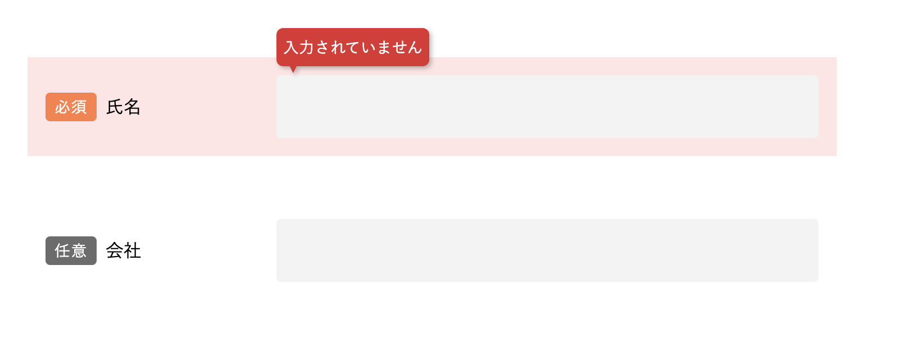

<!--
_class: title
_header: Bonus
-->

# ポップオーバーを簡単に実装したい

Popover API

---

<!--
_class: external-demo
-->

# Demo

---

# 【従来】モーダルやポップオーバーの実装は複雑

- 表示・非表示の制御
- ESCキーでの閉じる処理
- 背景クリックでの閉じる処理
- フォーカス管理

すべてJavaScriptで実装する必要があった

---

# 【モダン】 Popover API を使う

HTMLの属性だけでポップオーバーを実装できる

<div class="annotation-lang">HTML</div>

```html
<button popovertarget="my-popover">開く</button>

<div id="my-popover" popover>
  <p>ポップオーバーの内容</p>
  <button popovertarget="my-popover" popovertargetaction="hide">閉じる</button>
</div>
```

---

# Popover API の自動機能

- ESCキーで閉じる
- 背景クリックで閉じる
- 適切なフォーカス管理
- アクセシビリティ対応

JavaScriptなしで実現

---

# ポップオーバーの位置指定

ボタンの上下など特定の位置に表示したい場合は **Anchor Positioning** を使用

<div class="annotation-lang">CSS</div>

```css
.button {
  anchor-name: --my-anchor;
}

.popover {
  position-anchor: --my-anchor;
  position-area: block-end; /* ボタンの下に表示 */
}
```

**Anchor Positioning対応状況**: Chrome 125+（2024年5月）

---

# Popover API のブラウザ対応状況

<div class="column-2 browser">

<div>


</div>

<div class="browser-caption">

- 2023年5月にChrome 114で対応
- Safari 17.0（2023年9月）から対応
- Firefox 125（2024年4月）から対応
- **Baseline 2024** 対応済み

https://caniuse.com/mdn-api_htmlelement_popover

</div>

</div>

---

<!--
_class: title
_header: Bonus
-->

# 親要素の状態に応じて子要素のスタイルを変えたい

`:has()`

---

<!--
_class: external-demo
-->

# Demo

---

# `input` が不正なとき、親要素の背景の色を変える



<div class="justify-self-center">

<div class="annotation-lang">HTML</div>

```html
<div class="item">
  <!-- 背景を変えたい -->
  <label>氏名</label>
  <input required />
  <!-- 不正になりうる -->
</div>
```

</div>

---

# 【従来】JavaScriptを使っていた

- `input` の状態が変更されるイベントをチェック
- `.item` および `label`のスタイルをJavaScriptで更新

---

# 【モダン】 `:has()` を使う

子孫要素に `input:user-invalid`がある`.item`要素の背景の色を変える

<div class="annotation-lang">CSS</div>

```css
.item:has(input:user-invalid) {
  background: #ffe5e5;
}
```

---

# `:has()` のブラウザ対応状況

<div class="column-2 browser">

<div>


</div>

<div class="browser-caption">

- 2023年8月にChrome 105で対応
- Safari 15.4（2022年3月）から対応
- Firefox 121（2023年12月）から対応
- **Baseline 2024** 対応済み

https://caniuse.com/css-has

</div>

</div>