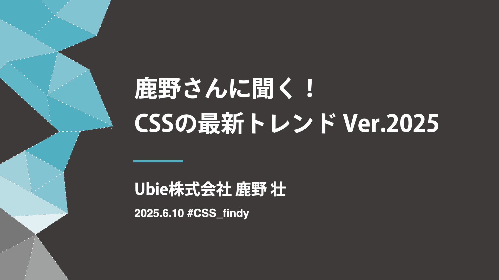

<script src="https://cdn.jsdelivr.net/npm/baseline-status@1/baseline-status.min.js" type="module"></script>



---

<!--
_class: message
-->

# 鹿野 壮

Claude Codeでもっと楽に開発する


@tonkotsuboy_com

---


---

# 本日の構成

<div class="text-note">

1. Hooks - タスク前後の自動化
2. Aqua Voice連携 - 高品質音声入力
3. カスタムスラッシュコマンド - 事前登録処理
4. Puppeteer MCP - GitHubスクリーンショット自動化
5. Kiro連携 - 要件・設計・実装の役割分担

</div>

---

<!--
_class: title
-->

# Hooks

タスク実行前後の自動化処理

---

<!--
_class: description
-->

# Hooksとは

- タスク開始時や終了時など、Claude Codeのさまざまな時点で任意のシェルコマンドを実行できる
- 例
  - タスク終了後にコードフォーマットをかける
  - タスク開始時の音声通知
  - コマンド実行中の状況把握
  - ログ記録の自動化

https://docs.anthropic.com/ja/docs/claude-code/hooks

---

# 実例:タスク終了後にオリジナル音声を鳴らす

<div class="annotation-lang">~/.claude/settings.json</div>

```json
  "hooks": {
    "Stop": [
      {
        "matcher": "",
        "hooks": [
          {
            "type": "command",
            "command": "afplay /Users/takeshi.kano/.claude/buhi.m4a"
          }
        ]
      }
    ]
  }
```

</div>

---

<!--
_class: external-demo
-->

<video controls>
<source src="demo/demo-placeholder.mp4" type="video/mp4">
</video>

---

<!--
_class: title
-->

# Aqua Voice連携

高品質音声入力による効率化

---

<!--
_class: description
-->

# Aqua Voice実用例

<div class="left">

```
「Claude Codeで新しい機能を追加して。
ユーザーのプロフィール編集画面を作成。
フォームバリデーションも含めて。
テストも書いて。」
```

リアルタイム音声認識
→ Claude Codeに送信
→ タスク実行

</div>

<div class="right">

## 特徴

- 高精度な音声認識
- リアルタイム処理
- 自然な日本語理解
- 複雑な指示にも対応
- ハンズフリー操作

Aqua Voice:
https://withaqua.com/

</div>

---

<!--
_class: external-demo
-->

<video controls>
<source src="demo/demo-placeholder.mp4" type="video/mp4">
</video>

---

<!--
_class: title
-->

# カスタムスラッシュコマンド

事前登録処理の素早い実行

---

<!--
_class: description
-->

# カスタムコマンド実用例

<div class="left">

## PR作成の自動化

```markdown
# /create-pr

現在のブランチの変更をPRとして作成します。

1. 変更内容を確認
2. コミットメッセージを生成
3. GitHubでPR作成
4. レビュアーを自動アサイン
```

`/create-pr` → 自動でPR作成完了

</div>

<div class="right">

## その他の活用例

- `/separate-commits` - コミット分離
- `/fix-tests` - テスト修正
- `/update-docs` - ドキュメント更新
- `/deploy` - デプロイ実行
- `/cleanup` - コード整理

Claude Codeスラッシュコマンド:
https://docs.anthropic.com/ja/docs/claude-code/slash-commands

</div>

---

<!--
_class: external-demo
-->

<video controls>
<source src="demo/demo-placeholder.mp4" type="video/mp4">
</video>

---

<!--
_class: title
-->

# Puppeteer MCP

MCPを活用した自動化ツール

---

<!--
_class: description
-->

# Puppeteer MCP実用例

<div class="left">

## GitHubスクリーンショット自動化

```javascript
// MCP作成例
const screenshot = await page.screenshot({
  path: 'github-issue.png',
  fullPage: true
});

// GitHub APIでアップロード
await uploadToGitHub(screenshot, {
  repo: 'my-project',
  issue: 123,
  comment: 'スクリーンショット追加'
});
```

</div>

<div class="right">

## MCP活用のメリット

- ブラウザ操作の自動化
- Claude CodeからWebページを操作
- スクリーンショット取得
- フォーム入力の自動化
- データ収集の効率化

Claude Code MCP:
https://docs.anthropic.com/ja/docs/claude-code/mcp

</div>

---

<!--
_class: external-demo
-->

<video controls>
<source src="demo/demo-placeholder.mp4" type="video/mp4">
</video>

---

<!--
_class: title
-->

# Kiro連携

要件・設計・実装計画の対話的作成

---

<!--
_class: description
-->

# Kiro連携実用例

<div class="left">

## 役割分担ワークフロー

**Kiro AIの役割:**

- 要件定義の対話的作成
- 設計書の詳細化
- 実装計画の立案
- タスクの分解・整理

**Claude Codeの役割:**

- 設計に基づく高速実装
- テストコードの作成
- デバッグとリファクタリング

</div>

<div class="right">

## 連携の流れ

1. **Kiro**: 要件をヒアリング
2. **Kiro**: 設計を詳細化
3. **Kiro**: 実装タスクを分解
4. **Claude Code**: 設計を読み込み
5. **Claude Code**: 効率的に実装

参考記事:
https://zenn.dev/ubie_dev/articles/kiro-claude-code

</div>

---

<!--
_class: external-demo
-->

<video controls>
<source src="demo/demo-placeholder.mp4" type="video/mp4">
</video>

---

<!--
_class: message
-->

# ご清聴ありがとうございました

Claude Codeでもっと楽に開発しましょう！

---

<!--
_class: finish
-->


