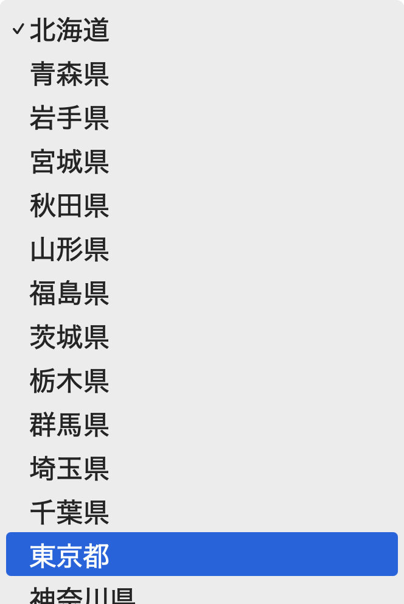
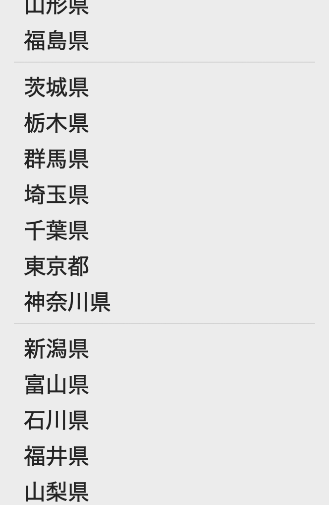
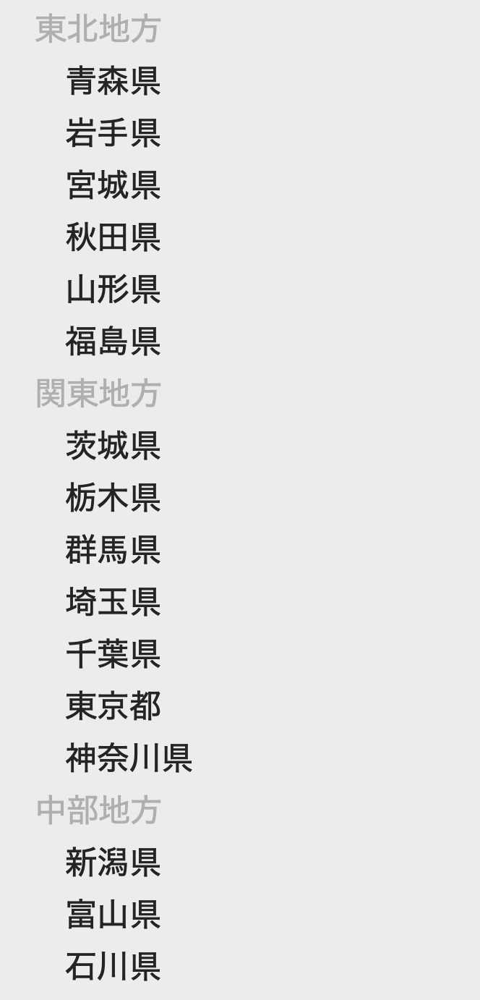
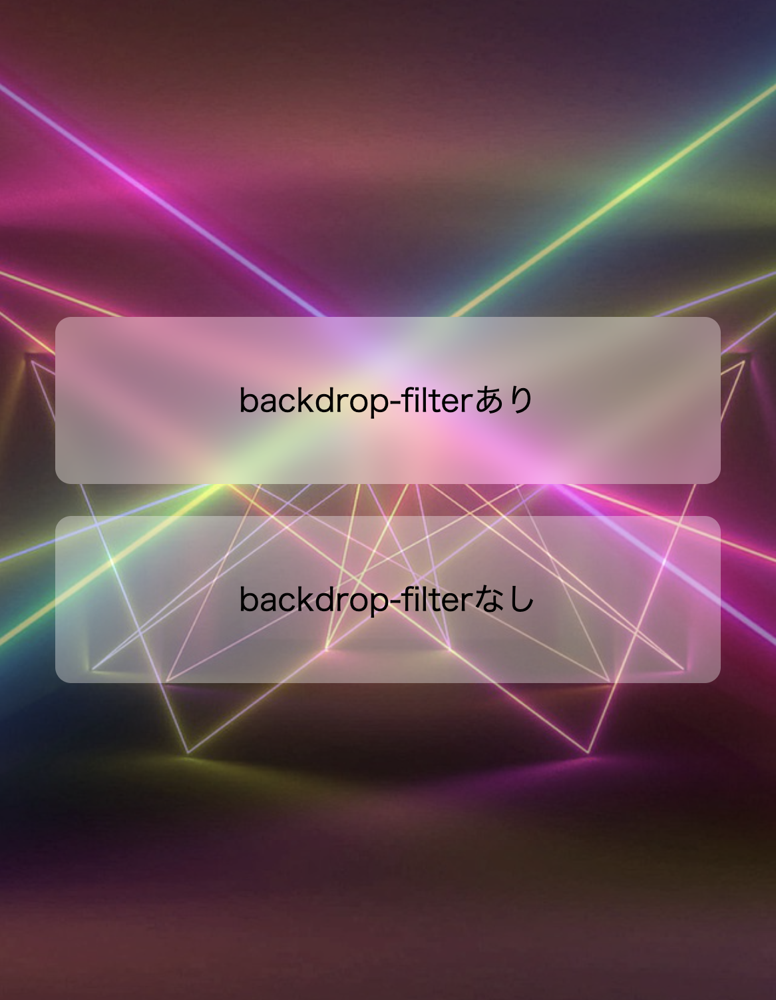
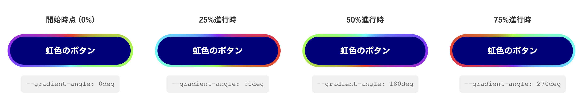
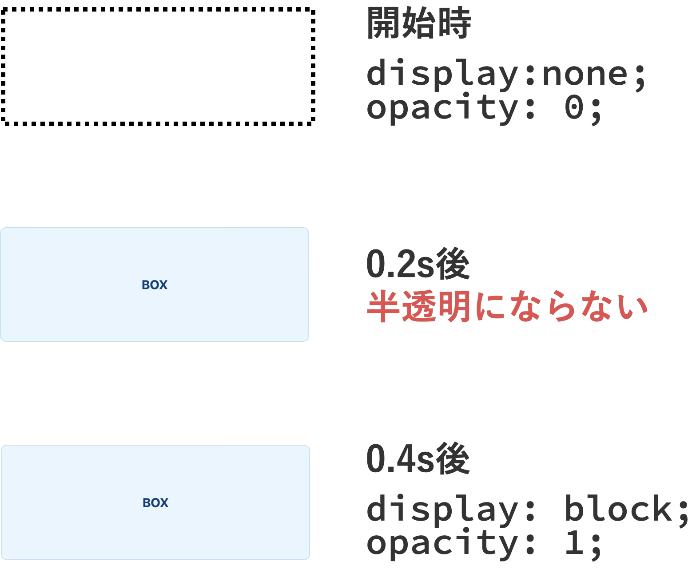
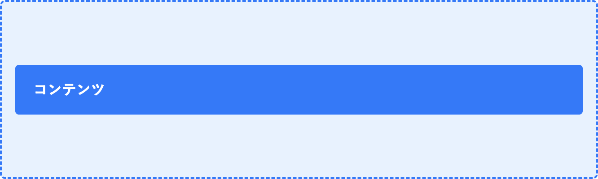
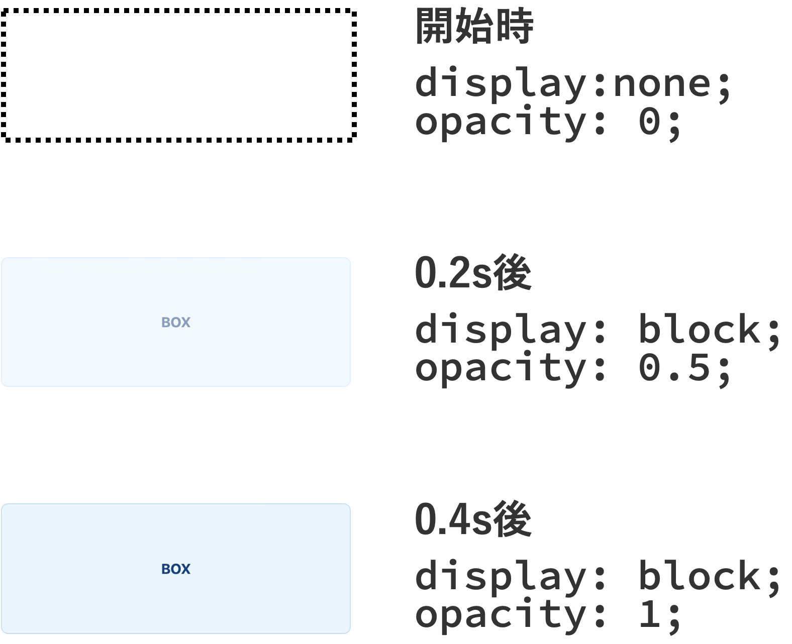

---
---
marp: true
theme: kano
---

<script src="https://cdn.jsdelivr.net/npm/baseline-status@1/baseline-status.min.js" type="module"></script>


---

<!--
_class: message
-->

# 鹿野 壮

CSSと猫が大好きです


@tonkotsuboy_com

---


---

# 本日の構成

<div class="text-note">

1. `<hr>` in `<select>`
2. ブロックレイアウトでの `align-content`
3. `backdrop-filter`と`background-clip: text`
4. CSSだけでネスト
5. `linear()`
6. `@property`
7. `@starting-style`

</div>


---

<!--
_class: message
-->

# 新しいCSSが日々生まれている

新しいCSSを学ぶメリットとは？

---

# 新しいCSSを学ぶメリット

- 長いJavaScriptで実現していたものが、<br>短いCSSで済む
- 読みやすいコードになり、<br>開発者体験（DX）が向上する
- バグが減り、制作物の品質が向上する


---

<!--
_class: chapter
_header: 01
-->

# 2025年最新CSS実践テクニック

---

<!--
_class: title
_header: 01
-->

# `<select>` の中で区切り線を表示したい

`<hr>` in `<select>`

---

<!--
_class: external-demo
-->

# Demo

---

# 【従来】 長い`<select>`は見づらい

<div class="column-2">

<div class="small-code">

<div class="annotation-lang">HTML</div>

```html
<select>
  <option value="hokkaido">北海道</option>
  <option value="aomori">青森県</option>
  <option value="iwate">岩手県</option>
  <option value="miyagi">宮城県</option>
  <option value="akita">秋田県</option>
  <option value="yamagata">山形県</option>
  <option value="fukushima">福島県</option>
  <option value="ibaraki">茨城県</option>
  <option value="tochigi">栃木県</option>
  <option value="gunma">群馬県</option>
  <!-- 中略 -->
  <option value="okinawa">沖縄県</option>
</select>
```

</div>

<div class="m2-4 mt-2">



</div>

</div>

---

<!--
_class: no-bottom
_header: 01
-->

# 【モダン】 `<hr>` で区切り線を入れられる

<div class="column-2">

<div class="small-code">

<div class="annotation-lang">HTML</div>

```html
<select>
  <option value="yamagata">山形県</option>
  <option value="fukushima">福島県</option>
  <hr />
  <option value="saitama">埼玉県</option>
  <option value="chiba">千葉県</option>
  <option value="tokyo">東京都</option>
  <option value="kanagawa">神奈川県</option>
  <hr />
  <option value="niigata">新潟県</option>
  <option value="toyama">富山県</option>
  <!-- 中略 -->
</select>
```

</div>

<div>

<div class="m2-4 mt-2">



</div>

</div>

---

# `<optgroup>` でグループ分けもできる（昔から）

<div class="column-2">

<div class="small-code">

<div class="annotation-lang">HTML</div>

```html
<select>
  <optgroup label="東北地方">
    <option value="aomori">青森県</option>
    <option value="iwate">岩手県</option>
    <!-- 中略 -->
  </optgroup>
  <optgroup label="関東地方">
    <option value="tokyo">東京都</option>
    <option value="kanagawa">神奈川県</option>
    <!-- 中略 -->
  </optgroup>
  <!-- 中略 -->
</select>
```

</div>

<div>



</div>

</div>

---

# `<hr>` in `<select>` のブラウザ対応状況

| ブラウザ | バージョン | リリース日 |
|---|---|---|
| Chrome | 119 | 2023年10月 |
| Edge | 119 | 2023年11月 |
| Safari | 17.0 | 2023年9月 |
| Firefox | 122 | 2024年1月 :new: |

https://caniuse.com/mdn-html_elements_select_hr_in_select

---

<!--
_class: title
_header: 02
-->

# 1行で垂直方向中央揃え。<br>FlexboxやGridなし

`align-content` in ブロックレイアウト

---

<!--
_class: external-demo
-->

# Demo

---

# 【従来】垂直方向の中央揃えは複雑だった

<div class="column-2">

<div>

複雑

<div class="annotation-lang">CSS</div>

<div class="small-code">

```css
.box {
  position: absolute;
  top: 50%;
  transform: translateY(-50%);
}
```

</div>


</div>

<div>

古い手法

<div class="annotation-lang">CSS</div>

<div class="small-code">

```css
.box {
  display: table-cell;
  vertical-align: middle;
}
```


</div>

</div>


<div>

FlexboxやGridが必要


<div class="annotation-lang">CSS</div>

<div class="small-code">

```css
.box {
  display: flex;
  align-items: center;
}
```

</div>


</div>

</div>

---

# 【モダン】1行で垂直方向の中央揃え


<div>

<div class="annotation-lang">CSS</div>

```css
.box {
  align-content: center;
}
```

</div>

<div class="text-note mt-4">

- `start` - 上端揃え
- `center` - 中央揃え
- `end` - 下端揃え

</div>

<small>※ `space-between`は動作しない</small>

---


# ブロックレイアウトでの `align-content` 対応状況

| ブラウザ | バージョン | リリース日 |
|---|---|---|
| Chrome | 123 | 2024年3月 |
| Edge | 123 | 2024年3月 |
| Safari | 17.4 | 2024年3月 |
| Firefox | 125 | 2024年4月 :new: |

https://caniuse.com/mdn-css_properties_align-content_block_context

---

<!--
_class: title
_header: 03
-->

# -webkit-が最近とれたシリーズ

`background-clip: text`
`backdrop-filter`

---

<!--
_class: external-demo
-->

# Demo

---

<!--
_class: description
-->


# `background-clip: text` で背景を文字の形で切り抜く

文字をグラデーションにする例

<div class="column-2 mt-4">
<div>

<div class="annotation-lang">CSS</div>

<div class="middle-code">

```css
.gradient-text {
  /* 背景グラデーション */
  background: 
    linear-gradient(-45deg, #2af598, #009efd);
  /* テキスト色を透明 */
  color: transparent;
  /* 背景を文字の形で切り抜く */
  background-clip: text;
}
```

</div>

</div>

<div class="self-center ml-4">


</div>
</div>


---

# `-webkit-` プレフィックスが不要に

<div>

Before

<div class="annotation-lang">CSS</div>

```css
.text {
  -webkit-background-clip: text;
  background-clip: text;
}
```

<div class="my-4"></div>

After

<div class="annotation-lang">CSS</div>

```css
.text {
  background-clip: text;
}
```

</div>

---

<!--
_class: description
-->

# `background-clip: text` のブラウザ対応状況

`-webkit-` プレフィックスが不要になったバージョン

| ブラウザ | バージョン | リリース日 |
|---|---|---|
| Chrome | 120 | 2023年10月 |
| Edge | 120 | 2023年12月 |

<div class="text-code-sm mt-4">
Firefox・Safariは昔から<br>-webkit- なしで対応済み
</div>

https://caniuse.com/background-clip-text

---

<!--
_class: description
-->


# `backdrop-filter` で背景にフィルターをかける

<div class="column-2">

<div>

<div class="annotation-lang">CSS</div>

```css
.glass-card {
  /* 背景を半透明に */
  background: 
      rgba(255, 255, 255, 0.1);
  /* 背景をぼかす */
  backdrop-filter: blur(10px);
}
```

</div>



</div>


</div>

---


# `-webkit-` プレフィックスが不要に


<div>

Before

<div class="annotation-lang">CSS</div>

```css
.text {
  -webkit-backdrop-filter: blur(10px);
  backdrop-filter: blur(10px);
}
```

<div class="my-4"></div>

After

<div class="annotation-lang">CSS</div>

```css
.text {
  backdrop-filter: blur(10px);
}
```

</div>


---

# `backdrop-filter` のフィルター関数

| 関数 | 効果 |
|------|------|
| `blur()` | ぼかし効果 |
| `brightness()` | 明度調整 |
| `contrast()` | コントラスト調整 |
| `saturate()` | 彩度調整 |

---

<!--
_class: description
-->

# `backdrop-filter` のブラウザ対応状況

`-webkit-` プレフィックスが不要になったバージョン

| ブラウザ | バージョン | リリース日 |
|---|---|---|
| Safari | 18.0 | 2024年9月 |

<div class="text-code-sm mt-4">
Chrome・Edge・Firefoxは昔から<br>-webkit- なしで対応済み
</div>

https://caniuse.com/css-backdrop-filter

---

<!--
_class: title
_header: 04
-->

# Sass ではなく、<br>CSS でネスト（入れ子）にする

---

<!--
_class: external-demo
-->

# Demo

---

<!--
_class: description
-->

# 【従来】ネストには Sass が必要だった

<div class="annotation-lang">SCSS</div>

```scss
.container {
  .child {
    color: red;
  }
}
```

---

# 【モダン】「CSS」でネストする

<!--
_class: description
-->

<div class="annotation-lang">CSS</div>

```css
.container {
  .child {
    color: red;
  }
}
```

---

# CSS ネストは、Sass のネストと「ほぼ」同じ

<div class="column-2">

<div>

<div class="annotation-lang">CSS</div>

```scss
.wrapper {
  .child1,
  .child2 {
    color: red;
  }
}
```

</div>

<div>

<div class="annotation-lang">CSS</div>

```scss
.link {
  &:hover,
  &:active {
    color: red;
  }
}
```

</div>

</div>

https://codepen.io/tonkotsuboy/pen/ExRbPgV


---


# とくに @media や @container のネストが便利

<div class="annotation-lang">CSS</div>

```scss
.box {
  color: blue;

  @media (width <= 800px) {
    color: red;
  }
}
```

---

# 2023年12月から要素セレクターの前の `&` が不要に

<div class="column-2">

<div>

Before

<div class="annotation-lang">CSS</div>

```scss
section {
  & h1 {
    color: red;
  }
}
```

</div>

<div>

After

<div class="annotation-lang">CSS</div>

```scss
section {
  h1 {
    color: red;
  }
}
```

</div>

</div>

[ネストの緩和された構文の更新 https://developer.chrome.com/blog/css-nesting-relaxed-syntax-update?hl=ja](https://developer.chrome.com/blog/css-nesting-relaxed-syntax-update?hl=ja)


---

<!--
_class: description
-->

# セレクター名の一部を `&` で表現するのは不可能

次のコードは動作しない

<div class="justify-self-center">

<div class="annotation-lang">CSS</div>

```css
.foo {
  &__bar {
    color: red;
  }
}
```

</div>

<footer>ジャンプできない・リファクタリングできない・コード検索が手間</footer>


---


# CSSネストのブラウザ対応状況

| ブラウザ | バージョン | リリース日 |
|---|---|---|
| Chrome | 120 | 2023年12月 :new: |
| Edge | 120 | 2023年12月 :new: |
| Safari | 17.2 | 2023年12月 :new: |
| Firefox | 117 | 2023年8月 |

https://caniuse.com/css-nesting

---

<!--
_class: title
_header: 05
-->

# バウンスなどのイージングを<br>transitionで使う

`linear()` イージング関数

---

<!--
_class: external-demo
-->

# Demo

---

# NEWアイコンのバウンスアニメーションをしたい


---

# 【従来】`animation`+`@keyframes`を使う

<div class="column-2">

<div>

<div class="justify-self-start">

<div class="annotation-lang">CSS</div>

<div class="small-code">

```css
.animation-sample {
  &:hover {
    animation: bounce-in-manual 0.8s forward;
  }
}

@keyframes bounce-in-manual {
  0% { scale: 1; }
  35% { scale: 1.56; } /* 1 + (1.4-1) × 1.4 */
  55% { scale: 1.34; } /* 1 + (1.4-1) × 0.85 */
  75% { scale: 1.44; } /* 1 + (1.4-1) × 1.1 */
  90% { scale: 1.38; } /* 1 + (1.4-1) × 0.95 */
  100% { scale: 1.4; }
}
```

</div>

</div>

</div>

<div class="text-note mt-2">

- `:hover`が外れたときのアニメーションをすると、コンテンツ読み込み時にもアニメーションしてしまう
- keyframeの記述が煩雑
- `transition`は表現不可能


</div>

</div>

---

# 【モダン】`transition`+`linear()`を使う

<div class="column-2">

<div>

<div class="justify-self-start">

<div class="annotation-lang">CSS</div>

<div class="small-code">

```css
.transition-sample {
  &:hover {
    transition-timing-function: linear(
      0, 
      1.4 35%, 
      0.85 55%, 
      1.1 75%, 
      0.95 90%, 
      1);
  }
}
```

</div>

</div>

</div>

<div>

- `transition`で表現できる
- `:hover`が外れたときのアニメーションをしても、コンテンツ読み込み時にはアニメーションしない👍

</div>

</div>

---

# `linear()`関数とは

アニメーションの進行度に応じた出力値を指定

```css
linear(0, 1.4 35%, 0.85 55%, 1.1 75%, 0.95 90%, 1)
```

| 進行度（%） | 出力値（相対値） |
|---|---|
| 0% | 0 |
| 35% | 1.4 |
| 55% | 0.85 |
| 75% | 1.1 |
| 90% | 0.95 |
| 100% | 1 |

---

# `linear()`関数のブラウザ対応状況

| ブラウザ | バージョン | リリース日 |
|---|---|---|
| Chrome | 113 | 2023年5月 |
| Edge | 113 | 2023年3月 |
| Safari | 17.2 | 2023年12月 :new: |
| Firefox | 112 | 2023年4月 |

https://caniuse.com/mdn-css_types_easing-function_linear-function

---

<!--
_class: title
_header: 06
-->

`@property`

# CSS変数をアニメーションしたい


---

<!--
_class: external-demo
-->

# Demo

---

<!--
_class: description
-->

# 虹色ボーダーのアニメーションをしたい

時間経過とともに、虹色ボーダーの模様が回転する



---

# 【従来】CSS変数はアニメーションできない

<div class="column-2">

<div>

<div class="annotation-lang">CSS</div>

```css
:root {
  --box-width: 100px;
}

.box {
  width: var(--box-width);
  transition: 1s;
}

.box:hover {
  --box-width: 200px;
}
```

</div>

<div class="text-note">

CSS変数はアニメーションできない

- ブラウザがCSS変数の型を認識できない
- 値の補間方法がわからない

</div>

</div>

---

# 【モダン】`@property`でCSS変数に型を定義

<div class="column-2">

<div>

<div class="annotation-lang">CSS</div>

```css
@property --box-width {
  syntax: "<length>";
  inherits: false;
  initial-value: 100px;
}

.box {
  width: var(--box-width);
  transition: 1s;
}

.box:hover {
  --box-width: 200px;
}
```

</div>

<div class="text-note">

- `syntax`: 値の型（長さ・色・角度など）
- `inherits`: 継承の可否
- `initial-value`: 初期値

</div>

</div>

---

# `@property`の`syntax`で指定できる型

| syntax | 説明 | 例 |
|---|---|---|
| `<length>` | 長さ | `100px`, `2em` |
| `<color>` | 色 | `red`, `#ff0000` |
| `<angle>` | 角度 | `45deg`, `0.5turn` |
| `<number>` | 数値 | `1.5`, `10` |
| `<percentage>` | パーセント | `50%`, `100%` |


---

# 虹色ボーダーの仕組み①: 複数の背景画像

<div class="column-2">

<div class="small-code">

<div class="annotation-lang">CSS</div>

```css
.rainbow-button {
  background-image: 
    /* 中心の色 */
    linear-gradient(navy),
    /* ボーダーの虹色 */
    conic-gradient(from var(--angle), ...);
}
```

</div>

<div class="text-note">

- カンマ区切りで複数の背景画像指定<br>内側の色、外側の虹色
- `linear-gradient`は単色指定ができるようになった<br>2025年4月から全ブラウザ対応
- 最初に書いたものが前面に表示される

</div>

</div>

---

# 虹色ボーダーの仕組み②: `background-clip`

<div class="column-2">

<div class="small-code">

<div class="annotation-lang">CSS</div>

```css
.rainbow-button {
  border: 6px solid transparent;
  background-clip: padding-box, border-box;
}
```

</div>

<div class="text-note">

- `padding-box`: <br>中心の色をボーダー内側まで
- `border-box`: <br>虹色をボーダー外側まで
- 虹色がボーダー部分に表示される

</div>

</div>

---

# `@property`のブラウザ対応状況

| ブラウザ | バージョン | リリース日 |
|---|---|---|
| Chrome | 85 | 2020年8月 |
| Edge | 85 | 2020年8月 |
| Safari | 16.4 | 2023年3月 |
| Firefox | 128 | 2024年7月 :new: |

https://caniuse.com/mdn-css_types_gradient_linear-gradient_single_color_stop

---


# 単色`linear-gradient(色)`のブラウザ対応状況

| ブラウザ | バージョン | リリース日 |
|---|---|---|
| Chrome | 135 | 2025年4月 :new: |
| Edge | 135 | 2025年4月 :new: |
| Safari | 18.4 | 2025年3月 |
| Firefox | 136 | 2025年3月|

https://caniuse.com/mdn-css_types_gradient_linear-gradient_single_color_stop

---


<!--
_class: title
_header: 07
-->

# display:noneの要素を表示するときに<br>アニメーションさせたい

`@starting-style`
`transition-behavior: allow-discrete`

---

<!--
_class: external-demo
-->

# Demo

---

# 【従来】display:noneからblockはアニメーションできない



理由: 「離散プロパティ」がアニメーションできないため

---

# 「離散プロパティ」とは？

段階的に変化せず、「あり」「なし」で切り替わるプロパティ

- `display: block` → `display: none`
  - 表示・非表示
- `visibility: visible` → `visibility: hidden`
  - 見える・見えない

---

# 【モダン】`@starting-style`で開始時のスタイルを指定

<div class="column-2">

<div class="small-code">

<div class="annotation-lang">CSS</div>

```css
.box {
  display: none; /* 初期状態 */
  opacity: 0;
  transition: 0.4s;
}

.box.open {
  display: block;
  opacity: 1;
  /* blockになった瞬間のスタイル */
  @starting-style {
    opacity: 0;
  }
}
```

</div>

<div class="text-note mt-4">

1. 要素が<code>display:block</code>になる
2. <code>opacity: 0</code>になる
3. <code>opacity: 1</code>に向かってアニメーションする

</div>

</div>

---

<!--
_class: description
-->

# blockからnoneに変わるときのアニメーションは？

離散プロパティがアニメーションできないため、<br>瞬時に非表示になってしまう

`transition-behavior: allow-discrete`で解決する

---

# 【モダン】`allow-discrete`


<div class="column-2">

<div>

<div class="annotation-lang">CSS</div>

```css
.box {
  display: none;
  opacity: 0;
  transition-duration: 0.4s;
  transition-behavior: 
      allow-discrete;
}

.box.open {
  display: block;
  opacity: 1;
}
```

</div>

<div>

1. <code>opacity</code>が0.4sかけて<code>0</code>になる
2. <code>display: none</code>になる

<div class="text-note ml-4">

`allow-discrete`の効果で、<code>display: none</code>が遅延される

</div>


</div>

</div>


---

# `allow-discrete`と`@starting-style`を組み合わせる

<div class="column-2">

<div>

<div class="annotation-lang">CSS</div>

```css
.box {
  display: none;
  opacity: 0;
  transition: 0.4s allow-discrete;
}

.box.open {
  display: block;
  opacity: 1;
  @starting-style {
    opacity: 0;
  }
}
```

</div>
<div class="text-note">

**表示時**
<code>@starting-style</code>の効果で
アニメーション

**非表示時**
<code>allow-discrete</code>の効果で
アニメーション

</div>

</div>

---

# `@starting-style` の適用タイミング

- 要素がDOMに新しく追加されたとき
- `display: none`から表示可能な値に変更されたとき
- `dialog.showModal()`でダイアログが表示されたとき

---

# 実例: dialogのアニメーション


---

# ブラウザ対応状況: `@starting-style`

| ブラウザ | バージョン | リリース日 |
|---|---|---|
| Chrome | 117 | 2023年9月 |
| Edge | 117 | 2023年9月 |
| Safari | 17.5 | 2024年5月 |
| Firefox | 129 | 2024年8月 :new: |

https://caniuse.com/mdn-css_at-rules_starting-style

---

# ブラウザ対応状況: `display`変更時の `allow-discrete`

| ブラウザ | 対応状況 | バージョン | リリース日 |
|---|---|---|---|
| Chrome | ◯ | 117 | 2023年9月 |
| Edge | ◯ | 117 | 2023年9月 |
| Safari | △ | 18.0 | 2024年9月 |
| Firefox | ✕ | - | - |

<div class="text-note mt-4">
Safariはcan i useでは対応済みとなっているが、動作せず
</div>

https://caniuse.com/mdn-css_properties_display_is_transitionable

---

<!--
_class: chapter
_header: 02
-->

# まとめ

本日紹介したモダンCSS

---

<!--
_class: description
-->


# 1. `<hr>` in `<select>`


セレクトボックス内で区切り線を表示

<div class="column-2 mt-10">

<div>


<div class="annotation-lang">HTML</div>

<div class="small-code">

```html
<select>
  <option value="yamagata">山形県</option>
  <option value="fukushima">福島県</option>
  <hr />
  <option value="saitama">埼玉県</option>
  <option value="chiba">千葉県</option>
  <hr />
  <option value="niigata">新潟県</option>
  <option value="toyama">富山県</option>
  <!-- 中略 -->
</select>
```

</div>

</div>

<div>


</div>

</div>

---

<!--
_class: description
-->


# 2. ブロックレイアウトで`align-content`

1行で要素の垂直方向の中央揃え


<div class="column-2">

<div>

<div class="annotation-lang">CSS</div>

```css
.box {
  align-content: center;
}
```

</div>

<div>




</div>

</div>

---

<!--
_class: description
-->


# 3-1.　`background-clip: text`の`-webkit-`不要化


テキストグラデーションを簡単に実現


<div class="column-2">

<div>

<div class="annotation-lang">CSS</div>


```css
.text {
  background: linear-gradient(...);
  background-clip: text;
  color: transparent;
}
```

</div>

<div class="self-center">


</div>

</div>

---


<!--
_class: description
-->


# 3-2. `backdrop-filter`の`-webkit-`不要化

背景のぼかし効果


<div class="column-2">

<div>

<div class="annotation-lang">CSS</div>


```css
.glass {
  backdrop-filter: blur(10px);
}
```

</div>

<div>


</div>

</div>

---

<!--
_class: description
-->


# 4. CSSのネスト

Sassを使わず入れ子にできる

<div class="mt-4">

<div class="annotation-lang">CSS</div>

```css
.container {
  .child {
    color: red;
  }
  
  @media (width <= 800px) {
    color: blue;
  }
}
```

</div>

---


<!--
_class: description
-->


# 5. `linear()` イージング関数

複雑なバウンスアニメーションを簡潔に記述


<div class="mt-6">

<div class="annotation-lang">CSS</div>

<div class="small-code">

```css
.box {
  transition-timing-function: linear(
    0, 1.4 35%, 0.85 55%, 
    1.1 75%, 0.95 90%, 1
  );
}
```

</div>
</div>

<div>


</div>

---

# 6. `@property`

CSS変数をアニメーションできるように

<div class="">

<div class="small-code">

<div class="annotation-lang">CSS</div>

```css
@property --gradient-angle {
  syntax: "<angle>";
}

.rainbow-border {
  background: conic-gradient(from var(--gradient-angle), ...  );
  animation: 2s rotate infinite linear;
}
```

</div>
</div>


---

# 7. `@starting-style`

<div class="column-2">

<div>

アニメーション開始時のスタイル指定

```css
.box.open {
  display: block;
  opacity: 1;
  
  @starting-style {
    opacity: 0;
  }
}
```

</div>

<div>



</div>

</div>

---

<!--
_class: message
-->

# 新しい知識を取り入れて<br>楽しくラクにウェブ制作をしましょう

---

<!--
_class: finish
-->


