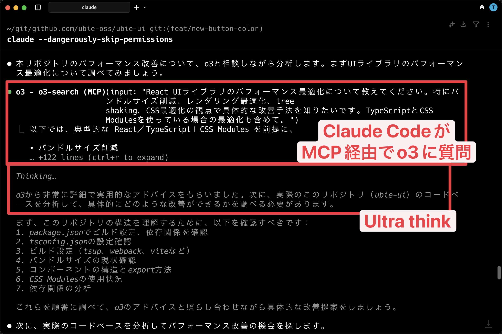

---

<!--
_class: message
-->

# 鹿野 壮

Claude Codeにタスク丸投げおじさん


@tonkotsuboy_com

---

# 本日の構成

<div class="text-note">

1. Hooks - タスク前後の自動化
2. Aqua Voice連携 - 高品質音声入力
3. カスタムスラッシュコマンド - 事前登録処理
4. Puppeteer MCP - GitHubスクリーンショット自動化
5. Kiro連携 - 要件・設計・実装の役割分担

</div>

---

<!--
_class: title
-->

# Hooksでタスク実行前後の<br>任意の処理をする

---

<!--
_class: description
-->

# Hooksとは

- タスク開始時や終了時など、Claude Codeのさまざまな時点で任意のシェルコマンドを実行できる
- 例
  - タスク終了後にコードフォーマットをかける
  - タスク開始時の音声通知
  - コマンド実行中の状況把握
  - ログ記録の自動化

https://docs.anthropic.com/ja/docs/claude-code/hooks

---

# 実例:タスク終了後にオリジナル音声を鳴らす

<div class="annotation-lang">~/.claude/settings.json</div>

```json
  "hooks": {
    "Stop": [
      {
        "matcher": "",
        "hooks": [
          {
            "type": "command",
            "command": "afplay /Users/takeshi.kano/.claude/buhi.m4a"
          }
        ]
      }
    ]
  }
```

</div>

---

<!--
_class: external-demo
-->

<video width="100%" controls src="./demo/hooks_voice.mp4">
</video>

---

<!--
_class: title
-->

# Aqua Voiceを使って<br>高品質な音声入力で命令する

---

<!--
_class: description
-->

# Aqua Voiceとは

- 高精度な音声認識とリアルタイム処理により、自然な日本語の文字起こしができる
- 言い間違いや「あー、うー」なども補正してくれる

https://withaqua.com/

---

# 実例:音声でタスク実行

- Claude Codeに音声で指示を出す
- 文字を長々打つよりもラク
- オフィスでやるとちょっと恥ずかしい

<div class="annotation-lang">音声入力例</div>

```
「ユーザーのプロフィール編集画面を作成して。
フォームバリデーションも含めて。
テストも書いて。」
```

---

<!--
_class: external-demo
-->

<video width="80%" controls src="./demo/aqua-voice.mov">
</video>

---

<!--
_class: title
-->

# カスタムスラッシュコマンドで<br>定型処理を素早く実行する

---

<!--
_class: description
-->

# スラッシュコマンドとは

- あらかじめ登録した処理を実行できる
- 毎回長いプロンプトを書く必要がない
- 組み込みスラッシュコマンド
  - `/doctor` claude codeのバグをチェック
  - `/review` コードレビューをリクエスト
https://docs.anthropic.com/ja/docs/claude-code/slash-commands

---

# カスタムスラッシュコマンドとは

- ユーザーが独自に登録した処理を実行できる
- 毎回命令している長いプロンプトがあればカスタムスラッシュコマンドに登録しておく方が便利
- .claude/commands/コマンド名.mdに処理を記述
- スコープを設定できる
  - グローバルで使う
  - プロジェクトで共有する
  - プロジェクトで自分だけが使う

https://docs.anthropic.com/ja/docs/claude-code/slash-commands

---

# 実例:PR作成の自動化

毎回やっているフォーマットとPR作成処理をカスタムスラッシュコマンド化

<div class="annotation-lang">~/.claude/commands/create-pr.md</div>

```markdown
## Description
このコマンドは以下の作業を自動で実行します：
1. `npm run format` でPrettierフォーマットを実行
2. 変更内容を適切な粒度でコミットに分割
3. GitHub PRを作成

## Implementation
prettierをかけたあと、適切な粒度でコミットし、PRを作って
**使用例:** `/create-pr` → 自動でPR作成完了
```

---

<!--
_class: external-demo
-->

<video width="100%" controls src="./demo/custom-slash.mp4">
</video>

---

<!--
_class: title
-->

# MCPの活用

---

<!--
_class: description
-->

# MCPとは

- Model Context Protocol（MCP）はClaude Codeを外部システムと連携させる仕組み
- よく使っているMCP
  - Puppeteer: ブラウザ操作の自動化
  - Figma: デザインファイルの取得
  - o3-search-mcp: Claude Codeが直接o3と相談する

https://docs.anthropic.com/ja/docs/claude-code/mcp

---

# 自作のMCPも作れる

- Ubie製MCP
  - Ubie社内のデザインシステムのMCPサーバー化
  - Google検索MCP
    - https://github.com/yukukotani/mcp-gemini-google-search

https://docs.anthropic.com/ja/docs/claude-code/mcp

---

# 実例: UltraThink + o3 MCP

- Claude Codeの拡張思考モードUltraThinkと、o3 MCPを使って課題を深く追求してもらう

例: 「本リポジトリのパフォーマンス改善のためにできることは何？ o3と相談しながら深く考えて」と尋ねる

---

# 実例: UltraThink + o3 MCP



---

<!--
_class: title
-->

# 詳細な仕様をKiroで作らせて、<br>Claude Codeで爆速実装

---

# Kiroとは

- 2025/07/15にAmazonがリリースしたIDE
- 要件・設計・実装計画の対話形式で作成できる

https://kiro.dev/blog/introducing-kiro/

---

# 対話形式で要件・設計・実装計画を対話形式で作成


---


---

<!--
_class: message
-->

# 実装もしてくれるが、遅かった・・・

---

# 速度に耐えられない弊社、Claude Codeに丸投げを思いつく


---

<!--
_class: description
-->

# 実例: Kiroの設計書をClaude Codeに丸投げ

- task.mdなどの仕様書をClaude Codeに投げる
- Kiroの設計力 × Claude Codeの爆速開発力により、質と速度の両取りができた

https://zenn.dev/ubie_dev/articles/kiro-claude-code

---

<!--
_class: external-demo
-->

<video width="80%" controls src="./demo/kiro.mp4">
</video>

---

<!--
_class: message
-->

# ご清聴ありがとうございました

Claude Codeでもっと楽に開発しましょう！

---

<!--
_class: finish
-->


